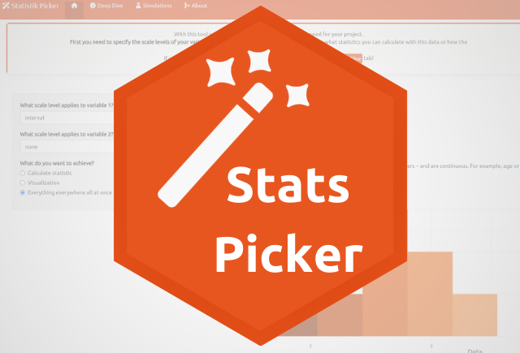

```{r echo = F}

```

## [Stats Picker Shiny App](https://the-tave.shinyapps.io/Stats-Picker)

Stats Picker is a Study Tool for learning statistics in a fun and accessible way. 
It provides explanations as well as fun simulations and interactive tools (available in English and German). 
It also offers a prompting guide for improved AI prompts to get to the desired results and explanations more efficiently.
It can even be installed as an app on mobile devices!
