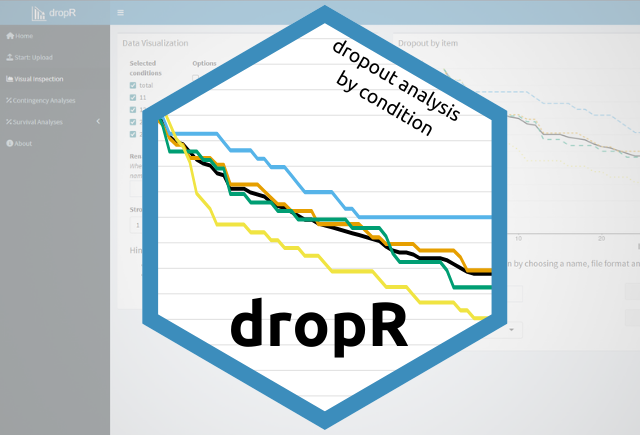

```{r echo = F}

```

## Double Trouble

This package & web app are here to help make dropout analysis a routine step of data analysis in research.

### [dropR package](https://cran.r-project.org/web/packages/dropR/index.html)

DropR is an R package to facilitate dropout analysis by condition. 
Dropout is an important measure to determine participants' motivation and also validity of results. 

### [dropR Shiny App](https://iscience-kn.shinyapps.io/dropR/)

Here you can get familiar with the principles of dropout analysis and try it out using your own data or a demo dataset.
The R package is more customizable but the App already lets you conduct publication-worthy dropout analysis including survival statistics and visualizations! 


## Open Science Spotlight: Analyzing dropout in online studies

After the paper on dropR that came out in 2025 (see [Publications](/publications.html)), the University of Konstanz Open Science team became aware of dropR and wrote a short "Spotlight" on it.
It highlights in accessible and mostly lay-friendly terms what dropR is and which advantages it brings.
You can read the Spotlight here: [www.campus.uni-konstanz.de/en/analyzing-dropout-in-online-studies](https://www.campus.uni-konstanz.de/en/analyzing-dropout-in-online-studies)

